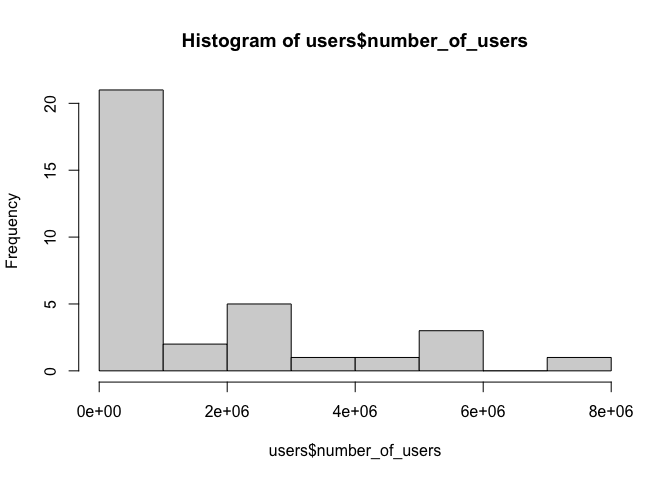

Tidy Tuesday: 27 March Lab Meeting
================
AS Huffmyer
2023

Loading data for Tidy Tuesday lab meeting practice.

# *Setup*

Set knit options.

``` r
knitr::opts_chunk$set(echo = TRUE, warning=FALSE, message=FALSE)
```

Load packages.

``` r
library(tidyverse)
library(RColorBrewer)
```

Load data frame for languages.

``` r
# Read in the data manually

languages <- readr::read_csv('https://raw.githubusercontent.com/rfordatascience/tidytuesday/master/data/2023/2023-03-21/languages.csv')
```

# *Examine dataset*

Look at languages dataset.

``` r
str(languages)
```

    ## spc_tbl_ [4,303 × 49] (S3: spec_tbl_df/tbl_df/tbl/data.frame)
    ##  $ pldb_id                          : chr [1:4303] "java" "javascript" "c" "python" ...
    ##  $ title                            : chr [1:4303] "Java" "JavaScript" "C" "Python" ...
    ##  $ description                      : chr [1:4303] NA NA NA NA ...
    ##  $ type                             : chr [1:4303] "pl" "pl" "pl" "pl" ...
    ##  $ appeared                         : num [1:4303] 1995 1995 1972 1991 1974 ...
    ##  $ creators                         : chr [1:4303] "James Gosling" "Brendan Eich" "Dennis Ritchie" "Guido van Rossum" ...
    ##  $ website                          : chr [1:4303] "https://oracle.com/java/" NA NA "https://www.python.org/" ...
    ##  $ domain_name                      : chr [1:4303] NA NA NA "python.org" ...
    ##  $ domain_name_registered           : num [1:4303] NA NA NA 1995 NA ...
    ##  $ reference                        : chr [1:4303] NA "https://www.w3schools.com/js/js_reserved.asp" "http://www.c4learn.com/c-programming/c-keywords/" "https://www.programiz.com/python-programming/keyword-list" ...
    ##  $ isbndb                           : num [1:4303] 400 349 78 339 177 128 111 151 269 270 ...
    ##  $ book_count                       : num [1:4303] 401 351 78 342 182 128 116 151 274 276 ...
    ##  $ semantic_scholar                 : num [1:4303] 37 48 19 52 37 6 7 37 26 9 ...
    ##  $ language_rank                    : num [1:4303] 0 1 2 3 4 6 5 7 8 9 ...
    ##  $ github_repo                      : chr [1:4303] NA NA NA NA ...
    ##  $ github_repo_stars                : num [1:4303] NA NA NA NA NA ...
    ##  $ github_repo_forks                : num [1:4303] NA NA NA NA NA ...
    ##  $ github_repo_updated              : num [1:4303] NA NA NA NA NA ...
    ##  $ github_repo_subscribers          : num [1:4303] NA NA NA NA NA ...
    ##  $ github_repo_created              : num [1:4303] NA NA NA NA NA ...
    ##  $ github_repo_description          : chr [1:4303] NA NA NA NA ...
    ##  $ github_repo_issues               : num [1:4303] NA NA NA NA NA NA NA NA 392 NA ...
    ##  $ github_repo_first_commit         : num [1:4303] NA NA NA NA NA ...
    ##  $ github_language                  : chr [1:4303] "Java" "JavaScript" "C" "Python" ...
    ##  $ github_language_tm_scope         : chr [1:4303] "source.java" "source.js" "source.c" "source.python" ...
    ##  $ github_language_type             : chr [1:4303] "programming" "programming" "programming" "programming" ...
    ##  $ github_language_ace_mode         : chr [1:4303] "java" "javascript" "c_cpp" "python" ...
    ##  $ github_language_file_extensions  : chr [1:4303] "java jav" "js _js bones cjs es es6 frag gs jake javascript jsb jscad jsfl jslib jsm jspre jss jsx mjs njs pac sjs ssjs xsjs xsjslib" "c cats h idc" "py cgi fcgi gyp gypi lmi py3 pyde pyi pyp pyt pyw rpy smk spec tac wsgi xpy" ...
    ##  $ github_language_repos            : num [1:4303] 11529980 16046489 2160271 9300725 1222 ...
    ##  $ wikipedia                        : chr [1:4303] "https://en.wikipedia.org/wiki/Java_(programming_language)" "https://en.wikipedia.org/wiki/JavaScript" "https://en.wikipedia.org/wiki/C_(programming_language)" "https://en.wikipedia.org/wiki/Python_(programming_language)" ...
    ##  $ wikipedia_daily_page_views       : num [1:4303] 5242 4264 6268 7204 3084 ...
    ##  $ wikipedia_backlinks_count        : num [1:4303] 11543 8982 10585 6849 4159 ...
    ##  $ wikipedia_summary                : chr [1:4303] "Java is a general-purpose computer programming language that is concurrent, class-based, object-oriented, and s"| __truncated__ "JavaScript (), often abbreviated as JS, is a high-level, dynamic, weakly typed, prototype-based, multi-paradigm"| __truncated__ "C (, as in the letter c) is a general-purpose, imperative computer programming language, supporting structured "| __truncated__ "Python is a widely used high-level programming language for general-purpose programming, created by Guido van R"| __truncated__ ...
    ##  $ wikipedia_page_id                : num [1:4303] 15881 9845 6021 23862 29004 ...
    ##  $ wikipedia_appeared               : num [1:4303] 1995 1995 2011 1991 1986 ...
    ##  $ wikipedia_created                : num [1:4303] 2001 2001 2001 2001 2001 ...
    ##  $ wikipedia_revision_count         : num [1:4303] 7818 6131 7316 6342 4153 ...
    ##  $ wikipedia_related                : chr [1:4303] "javascript pizza ada csharp eiffel mesa modula-3 oberon objective-c ucsd-pascal object-pascal beanshell chapel "| __truncated__ "java lua scheme perl self c python awk hypertalk actionscript coffeescript dart livescript objective-j opa perl"| __truncated__ "cyclone unified-parallel-c split-c cilk b bcpl cpl algol-68 assembly-language pl-i ampl awk c-- csharp objectiv"| __truncated__ "jython micropython stackless-python cython abc algol-68 c dylan haskell icon java lisp modula-3 perl boo cobra "| __truncated__ ...
    ##  $ features_has_comments            : logi [1:4303] TRUE TRUE TRUE TRUE TRUE NA ...
    ##  $ features_has_semantic_indentation: logi [1:4303] FALSE FALSE FALSE TRUE FALSE NA ...
    ##  $ features_has_line_comments       : logi [1:4303] TRUE TRUE TRUE TRUE TRUE NA ...
    ##  $ line_comment_token               : chr [1:4303] "//" "//" "//" "#" ...
    ##  $ last_activity                    : num [1:4303] 2022 2022 2022 2022 2022 ...
    ##  $ number_of_users                  : num [1:4303] 5550123 5962666 3793768 2818037 7179119 ...
    ##  $ number_of_jobs                   : num [1:4303] 85206 63993 59919 46976 219617 ...
    ##  $ origin_community                 : chr [1:4303] "Sun Microsystems" "Netscape" "Bell Labs" "Centrum Wiskunde & Informatica" ...
    ##  $ central_package_repository_count : num [1:4303] NA NA 0 NA 0 0 0 0 NA NA ...
    ##  $ file_type                        : chr [1:4303] "text" "text" "text" "text" ...
    ##  $ is_open_source                   : logi [1:4303] NA NA NA NA NA NA ...
    ##  - attr(*, "spec")=
    ##   .. cols(
    ##   ..   pldb_id = col_character(),
    ##   ..   title = col_character(),
    ##   ..   description = col_character(),
    ##   ..   type = col_character(),
    ##   ..   appeared = col_double(),
    ##   ..   creators = col_character(),
    ##   ..   website = col_character(),
    ##   ..   domain_name = col_character(),
    ##   ..   domain_name_registered = col_double(),
    ##   ..   reference = col_character(),
    ##   ..   isbndb = col_double(),
    ##   ..   book_count = col_double(),
    ##   ..   semantic_scholar = col_double(),
    ##   ..   language_rank = col_double(),
    ##   ..   github_repo = col_character(),
    ##   ..   github_repo_stars = col_double(),
    ##   ..   github_repo_forks = col_double(),
    ##   ..   github_repo_updated = col_double(),
    ##   ..   github_repo_subscribers = col_double(),
    ##   ..   github_repo_created = col_double(),
    ##   ..   github_repo_description = col_character(),
    ##   ..   github_repo_issues = col_double(),
    ##   ..   github_repo_first_commit = col_double(),
    ##   ..   github_language = col_character(),
    ##   ..   github_language_tm_scope = col_character(),
    ##   ..   github_language_type = col_character(),
    ##   ..   github_language_ace_mode = col_character(),
    ##   ..   github_language_file_extensions = col_character(),
    ##   ..   github_language_repos = col_double(),
    ##   ..   wikipedia = col_character(),
    ##   ..   wikipedia_daily_page_views = col_double(),
    ##   ..   wikipedia_backlinks_count = col_double(),
    ##   ..   wikipedia_summary = col_character(),
    ##   ..   wikipedia_page_id = col_double(),
    ##   ..   wikipedia_appeared = col_double(),
    ##   ..   wikipedia_created = col_double(),
    ##   ..   wikipedia_revision_count = col_double(),
    ##   ..   wikipedia_related = col_character(),
    ##   ..   features_has_comments = col_logical(),
    ##   ..   features_has_semantic_indentation = col_logical(),
    ##   ..   features_has_line_comments = col_logical(),
    ##   ..   line_comment_token = col_character(),
    ##   ..   last_activity = col_double(),
    ##   ..   number_of_users = col_double(),
    ##   ..   number_of_jobs = col_double(),
    ##   ..   origin_community = col_character(),
    ##   ..   central_package_repository_count = col_double(),
    ##   ..   file_type = col_character(),
    ##   ..   is_open_source = col_logical()
    ##   .. )
    ##  - attr(*, "problems")=<externalptr>

# *Questions that I want to answer*

1.  Which languages have the most users? Plot: Bar plot with total users
    on the Y, language on the X, ordered by total users

2.  Does user count relate to the age of the language? Plot: Scatter
    plot with correlation with year created on the X and users on the Y

3.  Which languages are most highly used in GitHub repos? Plot: Bar plot
    with GitHub users on the Y, language on the X, ordered by GitHub
    users

4.  Does having a language be open source relate to having more users?
    Plot: Scatter plot with language on X, users on Y, color by open
    source or not

# 1. Which languages have the most users?

First view a histogram of the number of users.

``` r
hist(languages$number_of_users)
```

<!-- -->

We need to remove the lower user counts to be able to see more
information about the higher user counts. Try removing any language with
less than 100,000 users.

``` r
users<-languages%>%
  select(number_of_users)%>%
  filter(number_of_users>100000)

hist(users$number_of_users)
```

<!-- -->

Plot the number of users for each language for languages with \>100,000
users.

``` r
languages%>%
  filter(number_of_users>100000)%>%
  
  ggplot(aes(x=reorder(title, -number_of_users), y=number_of_users, fill=factor(ifelse(title=="R","Highlighted","Normal"))))+
  geom_bar(stat = "identity", color="black")+
  scale_fill_manual(name = "area", values=c("red","white")) +
  xlab("Language")+
  ylab("Number of Users")+
  scale_y_continuous(labels = scales::comma)+
  theme_classic()+
  theme(
    axis.text.x = element_text(angle=45, hjust=1),
    legend.position="none"
  )
```

<!-- -->

The most used languages are SQL, Java, HTML, and C++.

# 2. Does user count relate to the age of the language?

Generate a scatter plot that shows the correlation between the year the
language was created and the number of users.

``` r
languages%>%
  #filter(number_of_users>100000)%>%
  
  ggplot(aes(x=appeared, y=number_of_users))+
  geom_point(color="gray")+
  stat_smooth(color="black")+
  xlab("Year Appeared")+
  ylab("Number of Users")+
  scale_y_continuous(labels = scales::comma)+
  theme_classic()
```

<!-- -->

This plot isn’t that helpful. Instead plot relationship between year and
number of users for languages with \>100,000 users.

``` r
languages%>%
  filter(number_of_users>100000)%>%
  
  ggplot(aes(x=appeared, y=number_of_users, color=factor(ifelse(title=="R","Highlighted","Normal"))))+
  geom_point()+
  stat_smooth(method="lm", color="black")+
  geom_text(aes(label=ifelse(number_of_users>4000000,as.character(title),'')),hjust=-0.2,vjust=0, color="black")+
  geom_text(aes(label=ifelse(title=="R",as.character(title),'')),hjust=-0.2,vjust=0, color="red")+
  scale_color_manual(name = "area", values=c("red","gray")) +
  geom_text(aes(label=ifelse(appeared<1965,as.character(title),'')),hjust=-0.2,vjust=0, color="black")+
  geom_text(aes(label=ifelse(appeared>2010,as.character(title),'')),hjust=-0.2,vjust=0, color="black")+
  xlab("Year Appeared")+
  ylab("Number of Users")+
  scale_y_continuous(labels = scales::comma)+
  theme_classic()+
  theme(
    legend.position="none"
  )
```

<!-- -->

There appears to be a weak positive relationship between age of lanugage
and the number of users (newer programs tend to have fewer users).

# 3. Which languages are most highly used in GitHub repos?

First view a histogram of the number of GitHub repos

``` r
hist(languages$github_language_repos)
```

<!-- -->

We need to remove the lower user counts to be able to see more
information about the higher repo counts. Try removing any language with
less than 100,000 repos.

``` r
git<-languages%>%
  select(github_language_repos)%>%
  filter(github_language_repos>100000)

hist(git$github_language_repos)
```

<!-- -->

Plot the number of GitHub repos for each language for languages with
\>100,000 repos.

``` r
languages%>%
  filter(github_language_repos>100000)%>%
  
  ggplot(aes(x=reorder(title, -github_language_repos), y=github_language_repos, fill=factor(ifelse(title=="R","Highlighted","Normal"))))+
  geom_bar(stat = "identity", color="black")+
  scale_fill_manual(name = "area", values=c("red","white")) +
  xlab("Language")+
  ylab("Number of GitHub Repos")+
  scale_y_continuous(labels = scales::comma)+
  theme_classic()+
  theme(
    axis.text.x = element_text(angle=45, hjust=1),
    legend.position="none"
  )
```

<!-- -->

The highest languages on GitHub are Java, HTML, and Python.

# 4. Do open source languages have more users?

Plot the number of users for each language and color the correlations by
those with open source programmings.

Remove any languages that have NA in the `is_open_source` column that we
don’t have information for.

``` r
languages%>%
  filter(!is.na(is_open_source))%>%
  
  ggplot(aes(x=is_open_source, y=number_of_users, color=factor(ifelse(title=="R","Highlighted","Normal"))))+
  geom_point()+
  geom_text(aes(label=ifelse(number_of_users>500000,as.character(title),'')),hjust=-0.2,vjust=0, color="black")+
  geom_text(aes(label=ifelse(title=="R",as.character(title),'')),hjust=-0.2,vjust=0, color="red")+
  scale_color_manual(name = "area", values=c("red","gray")) +
  geom_text(aes(label=ifelse(is_open_source==FALSE & number_of_users>10000,as.character(title),'')),hjust=-0.2,vjust=0, color="black")+
  xlab("Is the language open source?")+
  ylab("Number of Users")+
  scale_y_continuous(labels = scales::comma)+
  theme_classic()+
  theme(
    legend.position="none"
  )
```

<!-- -->

There are not many languages that we have information for from this data
set and there are only a few that are not open source. Of those that we
have information for, it appears that open source languages have more
users.
